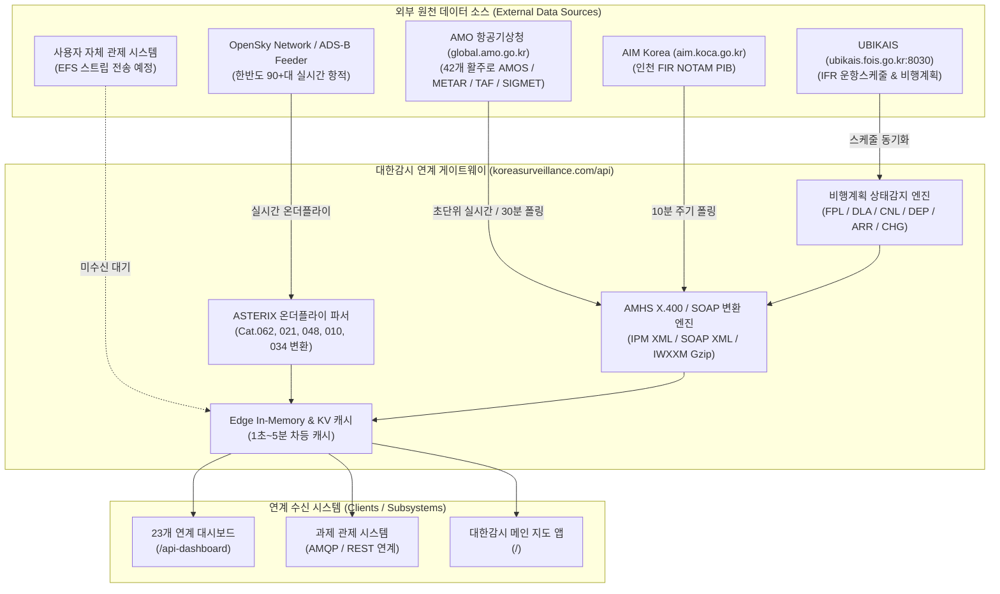

# 대한감시 (Korean Surveillance) - 23개 외부 연계 인터페이스 API 명세서

본 문서는 **대한감시(koreasurveillance.com / koreansurveillance.com)** 게이트웨이 서버가 제공하는 23개 항공/감시/기상/비행계획/운영 연계 인터페이스의 수집 원천, 변환 메커니즘, 호출 방법 및 표준 데이터 규격을 총괄 정의합니다.

---

## 1. 시스템 아키텍처 및 데이터 수집·변환 방식



### 데이터 수집 및 처리 정책

1. **항적 정보 (NO 1 ~ 8)**:
   - **처리 방식**: **실시간 온더플라이(On-the-fly) 파싱**.
   - **설명**: 별도의 무거운 DB 크롤러를 돌리지 않고, 수신된 순수 ADS-B 항적 데이터를 유로컨트롤(Eurocontrol) ASTERIX 카테고리 규격(Cat.062 융합항적, Cat.021 ADS-B, Cat.048 PSR/SSR 레이더, Cat.010 지상이동체, Cat.034 센서상태)에 맞춰 즉시 변환하여 송출합니다.
2. **기상 정보 (NO 9 ~ 12)**:
   - **실시간 AMOS (NO 9-A)**: 전국 42개 활주로 센서의 1~2초 초단위 실시간 관측치(순간풍, 2분/10분 평균풍, 시정, RVR, 운저고도, 기온, 습도, QNH, 현천, 강수량) 전수 제공.
   - **METAR / TAF / SIGMET / IWXXM**: 항공기상청(AMO)으로부터 5~30분 주기 수집 후 ICAO AMHS X.400 IPM XML로 래핑.
3. **항공고시보 (NO 13)**:
   - AIM Korea PIB 원천으로부터 10분 주기 폴링 캐싱 후 AMHS SOAP XML로 변환 송출.
4. **비행계획서 및 운항상태 변동 전문 (NO 14 ~ 20)**:
   - UBIKAIS IFR 스케줄 동기화를 기반으로 상태 변동을 감지하여 ICAO Doc 4444 전문 및 AMHS IPM/SOAP XML 생성.
5. **전자비행스트립 (NO 22)**:
   - **`사용자 자체 시스템 (연계 대기/미수신)`** 상태 유지. 임의의 가짜 스트립을 생성하지 않으며 사용자 시스템 데이터가 인입되면 즉시 중계.
6. **관제음성 (NO 21)**:
   - 항공보안법 제166조 및 군사보안 규정에 따라 국내 공역 음성 스트림의 공개망 청취 불가 안내 및 폐쇄망 연계 메타데이터 제공.

---

## 2. 비행계획 변동 이벤트(DLA, CNL, DEP, ARR, CHG) 트리거 원리

| 메시지 유형 | 명칭 | 트리거 조건 (변동 감지 원리) | ICAO Doc 4444 전문 형식 | AMHS 래핑 형식 |
|:---|:---|:---|:---|:---|
| **FPL** | 비행계획서 | UBIKAIS IFR 비행계획 접수/등록 시 | `(FPL-KAL867-IS-B77W/H-...-RKSI1030-N0480F350...-ZBAA0210)` | AMHS IPM XML |
| **DLA** | 비행 지연보 | UBIKAIS 스케줄에서 `ETD > STD` (예상 이륙시간 지연) 발생 시 | `(DLA-KAL867-RKSI0540-ZBAA-DOF/260820)` | AMHS SOAP XML |
| **CNL** | 비행계획 취소보 | UBIKAIS 스케줄 상 운항 상태가 `CNL`(결항/취소)로 플래그 변경 시 | `(CNL-KAL1847-RKPC0955-RKSI-DOF/260820)` | AMHS SOAP XML |
| **DEP** | 출발보 | 실시간 ADS-B 항적이 지상 ➡️ 공중 전환(이륙 감지) 또는 UBIKAIS `ATD` 입력 시 | `(DEP-CES5052/A2622-ZSPD1035-RKSI-DOF/260820)` | AMHS SOAP XML |
| **ARR** | 도착보 | 실시간 ADS-B 항적이 공중 ➡️ 지상 전환(착륙 감지) 또는 UBIKAIS `ATA` 입력 시 | `(ARR-DLH718/A359-EDDF-RKSI1048-DOF/260820)` | AMHS SOAP XML |
| **CHG** | 비행계획 변경보 | 제출된 비행계획의 순항고도(RFL), 항로, 도착공항 변경 감지 시 | `(CHG-CES5052-ZSPD0255-RKSI-DOF/260820\n-16/RKSI0141 ZSPD)` | AMHS IPM XML |

---

## 3. 23개 연계 인터페이스 상세 API 명세

### 1) 항적정보 (NO 1 ~ 8)

#### NO 1. 항적정보(융합) - ASTERIX Cat.062
- **엔드포인트**: `GET /api/asterix?cat=62`
- **파라미터**:
  - `limit`: 반환할 항적 최대 개수 (기본값: 50)
  - `raw`: `true` 설정 시 OpenSky 원본 데이터 반환
- **cURL 예시**:
  ```bash
  # 규격 변환 ASTERIX Cat.062 JSON
  curl "https://koreasurveillance.com/api/asterix?cat=62"

  # 원천 수집 Raw JSON
  curl "https://koreasurveillance.com/api/asterix?cat=62&raw=true"
  ```
- **응답 샘플 (ASTERIX Cat.062)**:
  ```json
  [
    {
      "asterixCategory": 62,
      "sac": 116,
      "sic": 251,
      "timeOfTrackSec": 18693.09,
      "trackNumber": 8631,
      "trackStatus": { "monitored": true, "spi": false, "confirmedTrack": true },
      "calculatedPositionWGS84": { "latitude": 37.4528, "longitude": 126.4419 },
      "calculatedTrackVelocity": { "vxMs": -12.4, "vyMs": -223.1, "speedKts": 435.0, "headingDeg": 185.2 },
      "flightLevel": "FL350",
      "targetAddress": "7821B7",
      "targetIdentification": "CSN318"
    }
  ]
  ```

#### NO 2. 항적정보(개별) - ASTERIX Cat.021
- **엔드포인트**: `GET /api/asterix?cat=21`
- **설명**: ADS-B 개별 타겟 레포트 (기하학적 고도 `geometricAltitudeFt`, 타겟 주소 `targetAddress`, 속도/방위각 포함).

#### NO 3. Radar 합성 항적 - ASTERIX Cat.048
- **엔드포인트**: `GET /api/asterix?cat=48&typ=COMBINED_PSR_SSR`
- **설명**: 1차/2차 감시 레이더 합성 항적 (Polar 좌표계 `rhoNm`, `thetaDeg` 포함).

#### NO 4. 지상이동체 항적 - ASTERIX Cat.010
- **엔드포인트**: `GET /api/asterix?cat=10`
- **설명**: 공항 표면 감시(G-SMGCS) 지상 이동체 및 유도로 항공기 항적.

#### NO 5. 레이더 상태 정보 - ASTERIX Cat.034
- **엔드포인트**: `GET /api/asterix?cat=34`
- **설명**: Mode-S North Mark 및 레이더 안테나 상태 메시지.

#### NO 6 & 7. Primary (PSR) / Secondary (SSR) 단독 항적
- **엔드포인트**: `GET /api/asterix?cat=48&typ=SINGLE_PSR` 및 `GET /api/asterix?cat=48&typ=SINGLE_SSR`

#### NO 8. 항적 통계 및 궤적 - Trace Stream
- **엔드포인트**: `GET /api/aircraft?lat=37.5&lon=127.0&radius=250`
- **설명**: 한반도 전역 항공기 위치, 궤적 이력 및 소스별(airplanes.live + OpenSky) 통계.

---

### 2) 기상정보 (NO 9 ~ 12)

#### NO 9. 정규 기상보고 (METAR)
- **엔드포인트**: `GET /api/amhs?type=METAR&icao=RKSI`
- **파라미터**: `icao` (공항코드), `raw` (`true` 시 원문 텍스트 반환)
- **응답 (AMHS IPM XML)**:
  ```xml
  <?xml version="1.0" encoding="UTF-8"?>
  <AMHS-Message xmlns="urn:icao:amhs:ipm:2020">
    <IPM-Heading>
      <Originator><CommonName>RKSSYPYX</CommonName></Originator>
      <PrimaryRecipient><CommonName>RKSIYPYX</CommonName></PrimaryRecipient>
      <Priority>GG</Priority>
      <FilingTime>200500</FilingTime>
    </IPM-Heading>
    <IPM-Body>
      <IA5Text-BodyPart>METAR RKSI 200500Z 27003KT 8000 -RA SCT008 BKN025 26/25 Q1014 NOSIG=</IA5Text-BodyPart>
    </IPM-Body>
  </AMHS-Message>
  ```

#### NO 9-A. 실시간 AMOS 관제기상 (55개 전 필드)
- **엔드포인트**: `GET /api/weather?type=amos&icao=RKSI`
- **설명**: 42개 활주로별 초단위 관측치 (순간풍 `wspd2minMax`, 2분/10분 평균풍 `wspd2minAvg`, 시정 `mor1min`, RVR `rvr1min`, 운저고도 `base1lyr`, 기온 `tmp`, 노점 `dp`, 습도 `hm`, QNH `qnh`, 강수량 `rn1hr`, 현천 `wwLttr`).

#### NO 10. 공항 예보 (TAF)
- **엔드포인트**: `GET /api/amhs?type=TAF&icao=RKSS`

#### NO 11. 위험기상특보 (SIGMET)
- **엔드포인트**: `GET /api/amhs?type=SIGMET`

#### NO 12. 디지털 기상 (IWXXM)
- **엔드포인트**: `GET /api/amhs?type=IWXXM&icao=RKSI`

---

### 3) 항공고시보 (NO 13)

#### NO 13. 항공고시보 (NOTAM)
- **엔드포인트**: `GET /api/amhs?type=NOTAM&location=RKSI`
- **원천**: AIM Korea (`aim.koca.go.kr`)
- **규격**: AMHS AIDA-NG SOAP Envelope XML

---

### 4) 비행계획서 (NO 14 ~ 20)

| NO | 유형 | 엔드포인트 | 원천 수집처 | 출력 규격 |
|:---:|:---|:---|:---|:---|
| 14 | FPL (비행계획서) | `GET /api/amhs?type=FPL&callsign=KAL867` | UBIKAIS IFR 스케줄 | AMHS IPM XML |
| 15 | CHG (변경보) | `GET /api/amhs?type=CHG&callsign=CES5052` | UBIKAIS 변경 감지 | AMHS IPM XML |
| 16 | CNL (취소보) | `GET /api/amhs?type=CNL&callsign=KAL1847` | UBIKAIS 결항 상태 | AMHS SOAP XML |
| 17 | DLA (지연보) | `GET /api/amhs?type=DLA&callsign=KAL867` | UBIKAIS 지연 상태 | AMHS SOAP XML |
| 18 | DEP (출발보) | `GET /api/amhs?type=DEP&callsign=CES5052` | ADS-B + UBIKAIS | AMHS SOAP XML |
| 19 | ARR (도착보) | `GET /api/amhs?type=ARR&callsign=DLH718` | ADS-B + UBIKAIS | AMHS SOAP XML |
| 20 | IPN (접수/통보) | `GET /api/amhs?type=METREPORT&icao=RKSI` | AMHS Switch | AMHS SOAP XML |

---

### 5) 운영 및 관제정보 (NO 21 ~ 23)

#### NO 21. 관제음성 (LiveATC)
- **엔드포인트**: `GET /api/voice?airport=RKSI`
- **상태**: `RESTRICTED_AIRSPACE` (항공보안법 제166조에 의거 국내 공역 실시간 오픈 스트리밍 미제공 및 폐쇄망 연계 인터페이스 정의)

#### NO 22. 전자비행스트립 (EFS)
- **엔드포인트**: `GET /api/flight-schedule?airport=RKSI&efs=true`
- **상태**: `STANDBY` (사용자 자체 관제 시스템 연계 대기 중 - 임의 합성 데이터 배제)

#### NO 23. 운항디스플레이 (FIDS)
- **엔드포인트**: `GET /api/flight-schedule?airport=RKSI`
- **원천**: UBIKAIS (`fois.go.kr:8030`) 실시간 출/도착 스케줄
